<div align="center">
  <div style="display: flex; justify-content: center; align-items: center; gap: 10px;">
    
    
    
  </div>

  # ⚡️ FastAPI RabbitMQ Microservices Project
  
  [](https://fastapi.tiangolo.com/)
  [](https://www.python.org/)
  [](https://www.docker.com/)
  [](https://www.rabbitmq.com/)
  [](https://www.postgresql.org/)

  <p align="center">
    A modern microservices architecture showcasing FastAPI, ML processing, authentication, and real-time notifications
    <br />
    <a href="#-installation"><strong>Get Started »</strong></a>
    <br />
    <br />
    <a href="#-services">Services</a>
    ·
    <a href="#-development-notes">Documentation</a>
    ·
    <a href="#-contributing">Contributing</a>
  </p>

  <!-- Decorative Line -->
  <hr style="width: 50%; margin: 30px auto; border: none; border-top: 1px solid #ccc;">
</div>


## 🏗️ Architecture Diagram

```mermaid
graph LR
    User((👤 User)) --> Gateway[API Gateway]
    
    subgraph Services
        Gateway --> Auth[🔐 Auth Service]
        Gateway --> ML[🤖 ML Service]
        Gateway --> Notify[📧 Notification Service]
    end
    
    subgraph Message Broker
        Queue[(RabbitMQ)]
    end
    
    Gateway --> Queue
    Queue --> ML
    Queue --> Notify
    
    subgraph Database
        DB[(PostgreSQL)]
    end
    
    Auth --> DB
    
    style Gateway fill:#ff5252,color:#fff
    style Auth fill:#2196f3,color:#fff
    style ML fill:#2196f3,color:#fff
    style Notify fill:#2196f3,color:#fff
    style Queue fill:#90caf9,color:#333
    style DB fill:#90caf9,color:#333
```

<div align="center">



</div>

The architecture consists of:
- 🌐 **API Gateway**: Central entry point for all client requests
- 🔐 **Auth Service**: Handles user authentication and authorization
- 🤖 **ML Service**: Processes image data and extracts text
- 📧 **Notification Service**: Manages email notifications
- 📦 **Message Broker**: RabbitMQ for service communication
- 🗄️ **Database**: PostgreSQL for data persistence

### Data Flow
1. User requests come through the API Gateway
2. Gateway routes requests to appropriate services
3. Services communicate through RabbitMQ message queue
4. Auth Service manages user data in PostgreSQL
5. ML Service processes images and returns results
6. Notification Service sends emails based on events


## 📋 Table of Contents
- [Overview](#-overview)
- [Services](#-services)
- [Prerequisites](#-prerequisites)
- [Installation](#-installation)
- [Development](#-development)
- [Troubleshooting](#-troubleshooting)
- [Contributing](#-contributing)

## 🎯 Overview

A modern microservices architecture built with FastAPI, featuring authentication, ML processing, notification services, and an API gateway. This project demonstrates best practices in microservices design and implementation.

## 🔧 Services

### 🔐 Auth Service
```
auth/
├── database.py      # Database configurations
├── main.py         # Service entry point
├── models.py       # Database models
├── schemas.py      # Pydantic schemas
├── service.py      # Business logic
└── requirements.txt
```
- User authentication
- Email verification
- OTP management
- PostgreSQL integration

### 🌐 Gateway Service
```
gateway/
├── main.py         # Service entry point
├── rpc_client.py   # RPC communication
└── requirements.txt
```
- Request routing
- Service orchestration
- Load balancing
- API documentation

### 🤖 ML Service
```
ml_services/
├── artifacts/      # Model artifacts
├── main.py        # Service entry point
├── utils.py       # Helper functions
└── requirements.txt
```
- Image processing
- Text extraction
- Model inference
- Data preprocessing

### 📧 Notification Service
```
notification_service/
├── email_service.py  # Email handling
├── main.py          # Service entry point
└── requirements.txt
```
- Email notifications
- Template management
- Queue processing

## 🛠️ Prerequisites

- Python 3.11.8
- Docker & Docker Compose
- Git
- PostgreSQL
- RabbitMQ

## 📥 Installation

### 1️⃣ Docker Services Setup

**PostgreSQL Database:**
```bash
docker run --name postgres-db \
  -e POSTGRES_PASSWORD=12 \
  -d -p 5432:5432 postgres
```

**RabbitMQ Message Broker:**
```bash
docker run -it --rm --name rabbitmq \
  -p 5672:5672 -p 15672:15672 \
  rabbitmq:3.13-management
```

### 2️⃣ Clone Repository
```bash
git clone https://github.com/vigneshs-dev/fastapi-rabbitmq-micro-service.git
cd fastapi-microservice-demo
```

### 3️⃣ Service Setup

<details>
<summary>🔐 Auth Service Setup</summary>

```bash
cd auth
python -m venv venv
source venv/bin/activate  # Windows: .\venv\Scripts\activate
pip install -r requirements.txt
python main.py
```
</details>

<details>
<summary>🌐 Gateway Service Setup</summary>

```bash
cd gateway
python -m venv venv
source venv/bin/activate  # Windows: .\venv\Scripts\activate
pip install -r requirements.txt
python main.py
```
</details>

<details>
<summary>🤖 ML Service Setup</summary>

```bash
cd ml_services
python -m venv venv
source venv/bin/activate  # Windows: .\venv\Scripts\activate
pip install -r requirements.txt
python main.py
```
</details>

<details>
<summary>📧 Notification Service Setup</summary>

```bash
cd notification_service
python -m venv venv
source venv/bin/activate  # Windows: .\venv\Scripts\activate
pip install -r requirements.txt
python main.py
```
</details>

## 🔍 Development Notes

- Each service runs in isolated environment
- Inter-service communication via RabbitMQ
- Gateway handles service discovery
- Configuration via environment variables

## ⚠️ Troubleshooting

<details>
<summary>🐳 Docker Issues</summary>

- Check Docker daemon status
- Verify port availability (5432, 5672)
- Review container logs:
  ```bash
  docker logs [container-name]
  ```
</details>

<details>
<summary>🔧 Service Issues</summary>

- Verify virtual environment activation
- Check service logs
- Confirm dependency installation
- Validate configuration files
</details>

## 🤝 Contributing

Check [CONTRIBUTING.md](CONTRIBUTING.md) file along with [CODE_OF_CONDUCT.md](CODE_OF_CONDUCT.md) to contribute.

## 📝 License

This project is licensed under the MIT License - see the [LICENSE](LICENSE) file for details.

---
<div align="center">
  Made with ❤️ by VigneshS
</div>